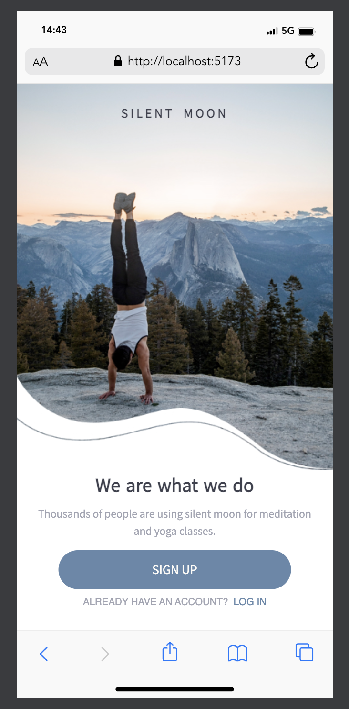
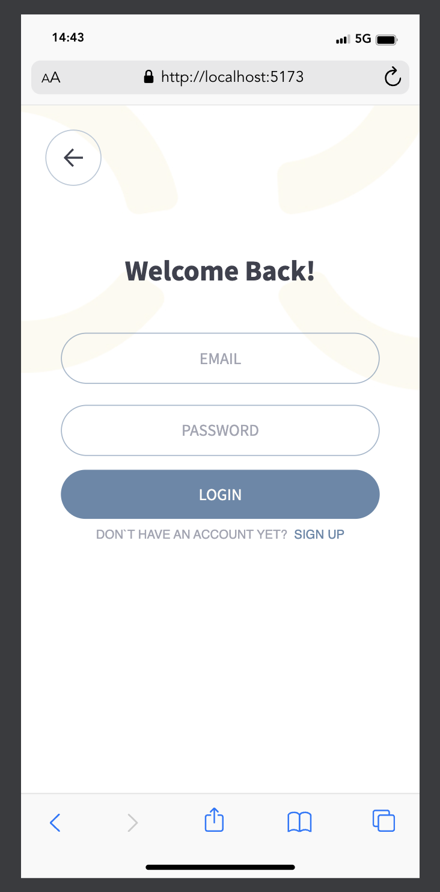
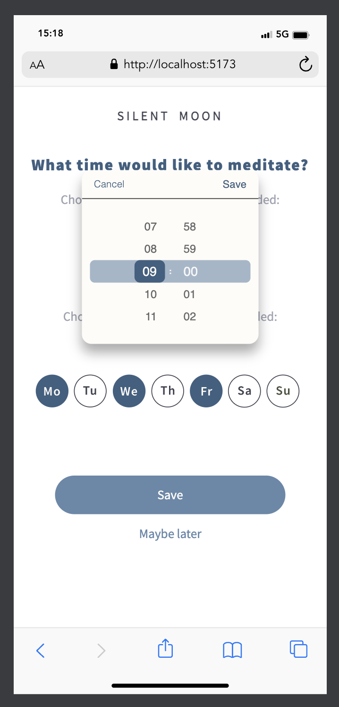
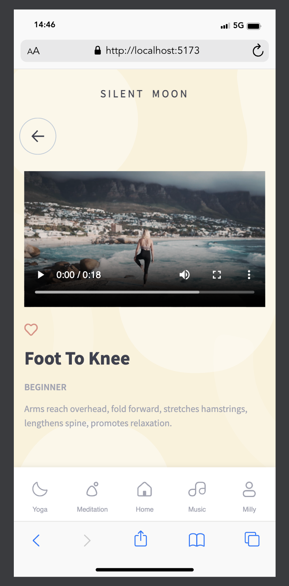
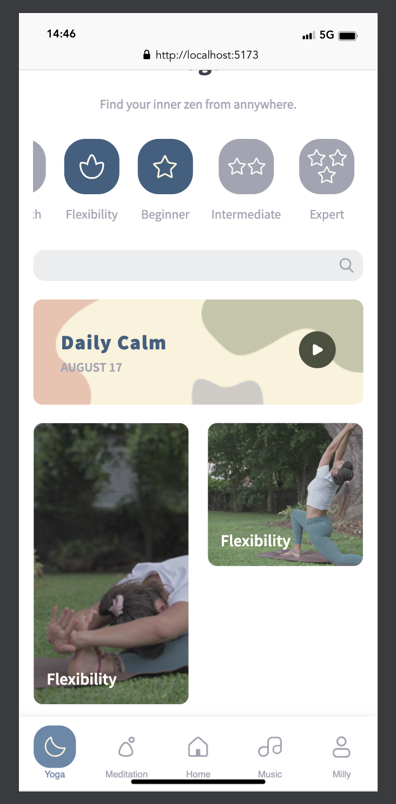
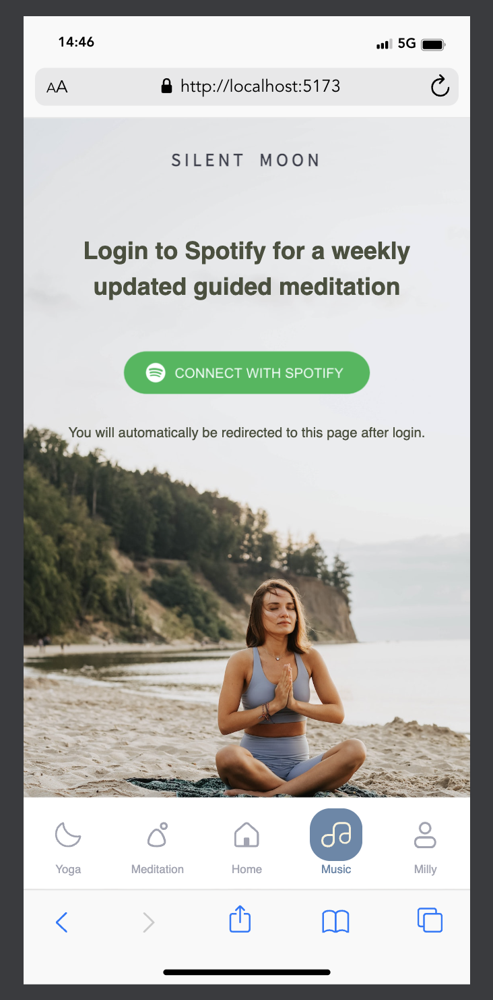
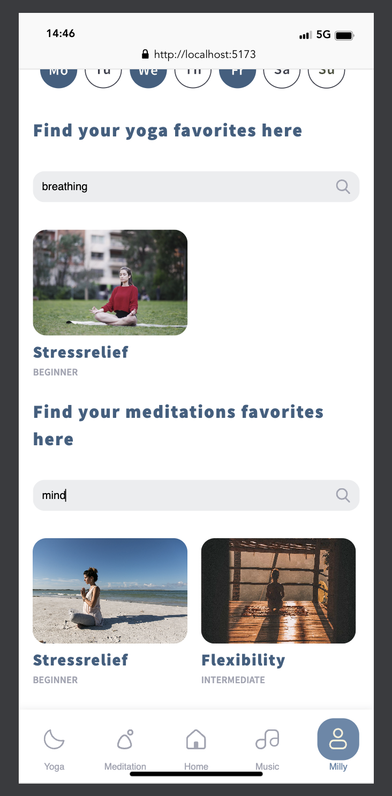

## Welcome to Silent Moon

### About this fork

I initially contributed to this project as a member of a collaborative team.
Once the project was completed and presented I decided to go at it again to fully grasp each individual work, approach and solution.

I introduced changes that focused on enhancing component reusability and decided to give it a slightly new look.

I tried to focus on the reusability factor across different sections of the app by refactoring and reorganizing components.
Since I was initially working on the backend part of the project I enjoyed changing perspective and going through the frontend - finding different work arounds and more simplified code snippets.

### About Silent Moon

Breath and relax.
Find yourself a short visual yoga instruction or meditate in peace. Either way - if you want to get body and mind together Silent Moon is for you.

Sign up, log in and get started.
Set up day and time to be reminded of your yoga or meditation session.
Save your favourites and connect with your Spotify Account to access and enjoy specific playlists.
You can easily search for exercises that target specific body parts or mental and physical benefits.
Filter exercises by category and/or difficulty level to meet your specific needs.

### The tools behind it

- We used the **_MERN-Stack_** for the development of this project
- With **_Mongoose_** we defined schemas and created Models
- For handling the video/thumbnail and image data we used **_GridFS_**
- Playing the videos is done via [ReactPlayer](https://github.com/cookpete/react-player.git)
- The time can be set via [react-ios-time-picker](https://github.com/MEddarhri/react-ios-time-picker.git)

### Get some impressions
or check here: https://silentmoon-6qa3.onrender.com/

    
    
    
    
    
    
    
    

